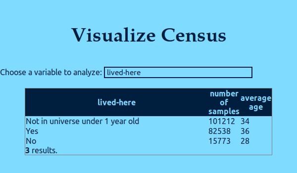

# US-census visualisation

This is a small single-page web app to visualize US census data

## Project status
The project is currently in a working state,
waiting to be reviewed.

## Demo

A demonstration server is running on
http://visualize-census.eu-2.evennode.com/.

## Technological stack

#### Frontend



The frontend is very simple: it is composed of
a single page, that allows the user to choose which
dimension of the data to analyze, then queries the server,
and displays the results in a table.

It is written in [Elm](http://elm-lang.org/).

#### Backend
##### Application
It is a simple layer that serves the static assets,
and answers to API queries by fetching data in the
database.

It uses [NodeJS](https://nodejs.org/en/)
with [express](https://expressjs.com/).

##### Database
The original database file schema was quite
inefficient for the kind of queries we have to do.

A python script is provided (`src/backend/import-db.py`)
that takes a database in the old format, and
generates a new optimized database in
`src/backend/census.db`

For the sake of simplicity,
the new database uses [SQLite](http://sqlite.org/) too.
Performance in a single user context is currently very good.
However, migrating to another RDMS
might be wanted as the data volume grows.

## How to use

#### Dependencies
Ensure you have node (>=6) and python (>=3.5) installed.

In a debian-based distribution, you can install them with

```
sudo apt install nodejs python3
```

#### Launch the server

A launch script is provided, that creates the optimized database,
compiles Elm files to javascript, and launches the server.
Launch is with:

```
npm start
```
